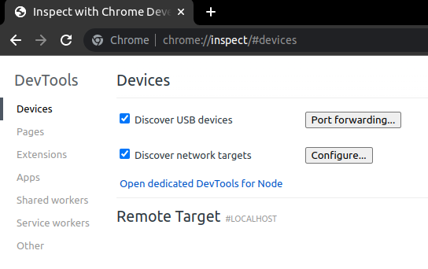

# robotlab-x-app
react front end for robotlab-x

## tools for development
```bash
curl -N -k -i -H "Connection: Upgrade" -H "Upgrade: websocket" -H "Sec-WebSocket-Version: 13" -H "Sec-WebSocket-Key: <random-key>" https://localhost:8443
```

# debugging chrome in the headset remotely
on remote computer
quest 2 - turn all debugging on
```
chrome://inspect/#devices
```



## setup for development
package.json
,
  "proxy": "http://localhost:8888"

setupProxy.json
```js
const { createProxyMiddleware } = require('http-proxy-middleware')

module.exports = function(app) {
  app.use(
    '/api',
    createProxyMiddleware({
      target: 'http://192.168.0.119:8888',
      changeOrigin: true,
      ws: true
    })
  )
}```


```js
const { createProxyMiddleware } = require('http-proxy-middleware')

const proxyOptions = {
  target: 'http://localhost:8888',
  changeOrigin: true,
  ws: true,
}

const httpsProxy = createProxyMiddleware(proxyOptions)

const wsProxy = createProxyMiddleware(proxyOptions)

const createProxyMiddleware = (req, res, next) => {
  if (req.protocol === 'https') {
    httpsProxy(req, res, next)
  } else if (req.headers.upgrade === 'websocket') {
    wsProxy(req, res, next)
  } else {
    next()
  }
}
```

currently you need to run 
```bash
npm run build
``` 
and start the quest 2 meta browser to https://{hostip}:{port}/webxr in order to get the websockets to work
proxy through npm is not working
